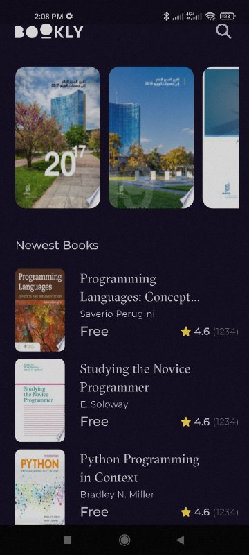

# 📚 Bookly

Bookly is a modern, responsive Flutter app for discovering and reading books fetched from the Google Books API. The app features a clean animated splash screen, smooth transitions, and well-structured architecture using MVVM and Cubit.

---

## 🚀 Features

- ✅ **Animated Splash Screen** with logo and slogan
- ✅ **Home View** with:
  - Horizontally scrollable **Featured Books**
  - Vertically scrollable **Newest Books**
- ✅ **Book Details Screen** with:
  - Full book information
  - Preview button that opens the book for reading
  - List of similar books underneath
- ✅ Navigation using **GoRouter**
- ✅ **MVVM Architecture** + **Cubit (Flutter Bloc)**
- ✅ Beautiful loading animations using **Skeletonizer**
- ✅ Optimized images with **CachedNetworkImage**
- ✅ Responsive design compatible with phones & tablets
- ✅ Robust API handling using **Dio**

---

## 🖼️ Screenshots

## 📸 Screenshots

| Splash View | Home View | Details View |
|-------------|----------|------------|
|  |  |  |

---

## 🧰 Tech Stack

- **Flutter** 3.x
- **State Management**: Cubit (flutter_bloc)
- **Routing**: GoRouter
- **HTTP Client**: Dio
- **Image Caching**: CachedNetworkImage
- **Loading UI**: Skeletonizer
- **Architecture**: MVVM
- **Dependency Injection**: GetIt

---

## 📦 Packages Used

```yaml
go_router: ^16.0.0
google_fonts: ^6.2.1
font_awesome_flutter: ^10.8.0
equatable: ^2.0.7
dartz: ^0.10.1
dio: ^5.8.0+1
flutter_bloc: ^9.1.1
get_it: ^8.0.3
cached_network_image: ^3.4.1
url_launcher: ^6.3.2
skeletonizer: ^1.4.3
```

---

## 🔧 Getting Started

1. Clone the repo:

```bash
git clone https://github.com/your-username/bookly.git
cd bookly
```

2. Get dependencies:

```bash
flutter pub get
```

3. Run the app:

```bash
flutter run
```

> Make sure your Flutter SDK is 3.29.3 or higher.

---

## 📚 API

This app uses the [Google Books API](https://developers.google.com/books) to fetch real-time book data.

---

## 👤 Author

**Ahmed Rizk**  
- [GitHub](https://github.com/a7med287)
- [Linkedin](https://www.linkedin.com/in/ahmed-rezk-966985322?utm_source=share&utm_campaign=share_via&utm_content=profile&utm_medium=android_app)  

---

## 📌 Future Improvements

- 🔍 Add a search feature
- 📂 Bookmarking & local storage
- 🌐 Dark mode & localization

---
